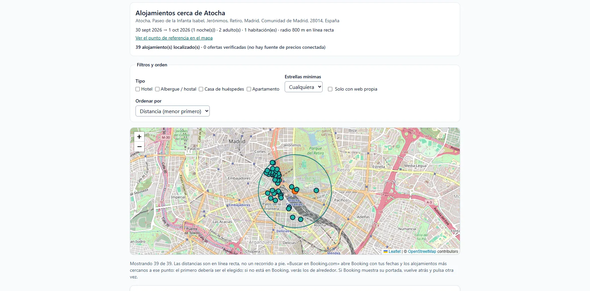
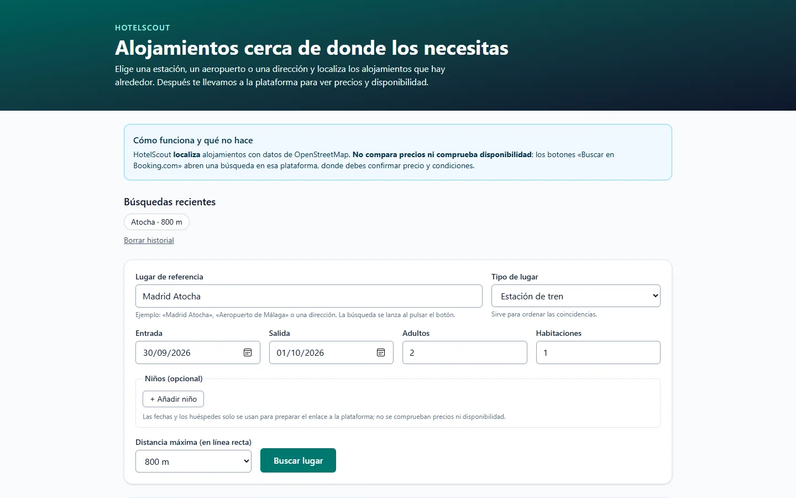
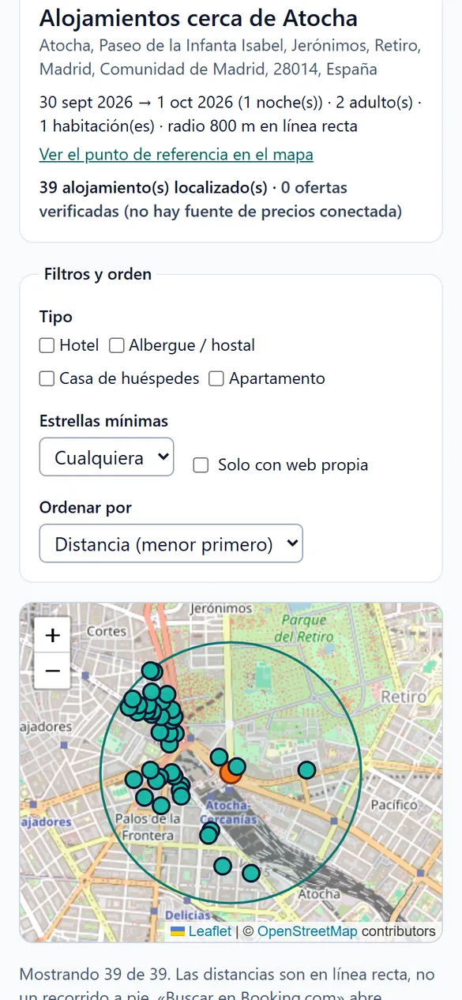

# HotelScout

[](https://github.com/EricKColl/hotelscout/actions/workflows/ci.yml)
[](https://hotelscout.pages.dev)
[](LICENSE)

**Localiza alojamientos reales cerca de una estación, un aeropuerto o una dirección**, con datos de OpenStreetMap, y abre después la plataforma para ver precios y disponibilidad. PWA en español, coste 0 €, sin cuentas ni rastreadores.

🔗 **Demo:** <https://hotelscout.pages.dev>



> **Importante:** HotelScout **no compara precios ni comprueba disponibilidad**. Ninguna API hotelera con precios reales es accesible gratis y sin acuerdo comercial (Booking y Expedia exigen ser socio; el portal gratuito de Amadeus cerró en julio de 2026). En lugar de simular tarifas, la aplicación localiza los alojamientos y lo dice con claridad. Detalle y fuentes: [`docs/provider-research.md`](docs/provider-research.md).

## Qué hace

- Busca un lugar (Nominatim) y **obliga a elegir** cuando hay varias coincidencias.
- Localiza alojamientos con nombre en un radio de 300 m a 5 km (Overpass) con distancia real en línea recta (Haversine).
- Mapa con **nombres en español en todo el mundo** (Tokio, no 東京), punto de referencia, radio y marcadores; al pulsar un marcador, la lista salta a su ficha. Filtros por tipo, estrellas y web propia; ordenación.
- Botón **«Buscar en Booking.com»** con tus fechas y huéspedes: búsqueda por coordenadas ordenada por distancia. Es un enlace de búsqueda, no una oferta.
- Favoritos e historial guardados solo en tu navegador. Instalable como app; abre sin conexión avisando de que no hay conexión.

<p>
  
  
</p>

## Decisiones de diseño

- **Nada inventado:** sin precio real, la tarjeta dice «Consultar precio»; contadores separados de «localizados» y «ofertas verificadas».
- **Errores distintos:** sin alojamientos ≠ límite alcanzado ≠ servicio caído ≠ sin conexión ≠ búsqueda parcial.
- **Proxy propio** (Cloudflare Pages Functions) hacia Nominatim y Overpass: cumple sus políticas (1 petición/s en total, `User-Agent`, caché, sin autocompletado), valida entradas y usa una plantilla de consulta fija.
- **Enlaces clasificados** como oficial y documentado, funciona pero no documentado, o no fiable. Registro completo en [`docs/decisions.md`](docs/decisions.md).
- **Validaciones basadas en pruebas reales:** fechas hasta ~16 meses, no más habitaciones que adultos, estancia máxima de 30 noches.

```text
Navegador (React PWA) ──► /api/* (Pages Functions: caché, límites, User-Agent) ──► Nominatim · Overpass
```

## Tecnologías

React 19 · TypeScript estricto · Vite · Tailwind CSS 4 · Leaflet + MapLibre (teselas de OpenFreeMap) · TanStack Query · Zod · Vitest · Playwright + axe · Cloudflare Pages Functions · PWA con service worker propio.

## Calidad

| Comprobación | Resultado |
|---|---|
| Unitarias e integración (Vitest) | 85 |
| End-to-end (Playwright: flujo, errores, PWA sin conexión, móvil, mapa con CSP de producción) | 21 |
| Accesibilidad automática (axe, WCAG 2.x A/AA) | 0 infracciones |
| Vulnerabilidades (`npm audit`) | 0 |
| Verificación real | Nominatim, Overpass, Cloudflare y enlaces de Booking probados en navegador real |

Informe completo, incidencias encontradas y limitaciones: [`docs/qa-report.md`](docs/qa-report.md) y [`docs/limitations.md`](docs/limitations.md).

## Desarrollo

Requiere Node.js 20 o superior (probado con 22 y 24).

```bash
npm install
npm run dev            # http://localhost:5173 (incluye /api con caché en memoria)
npm run build          # producción en dist/
npm run lint
npm test               # unitarias + integración
npm run test:e2e       # end-to-end (Edge instalado; PW_CHANNEL=chromium tras `npx playwright install chromium`)
npm run test:live      # comprobación REAL contra Nominatim/Overpass; consume cuota pública, con moderación
```

Variables de entorno: solo `PROXY_CONTACT` (contacto incluido en el `User-Agent` del proxy). No hay claves ni secretos. Ver [`.env.example`](.env.example).

## Despliegue

Cloudflare Pages (plan gratuito): compilación `npm run build`, salida `dist`, carpeta `functions/` detectada automáticamente. Pasos y cuotas en [`docs/deployment.md`](docs/deployment.md).

## Documentación

[`architecture.md`](docs/architecture.md) · [`provider-research.md`](docs/provider-research.md) · [`decisions.md`](docs/decisions.md) · [`qa-report.md`](docs/qa-report.md) · [`limitations.md`](docs/limitations.md) · [`deployment.md`](docs/deployment.md) · [`viaje-con-esim.md`](docs/viaje-con-esim.md) (uso de viaje con datos móviles o eSIM)

## Datos y privacidad

Datos © colaboradores de [OpenStreetMap](https://www.openstreetmap.org/copyright), licencia ODbL. Sin cuentas ni analítica; favoritos e historial en `localStorage` con botón para borrarlos.

## Licencia

MIT — ver [`LICENSE`](LICENSE).
